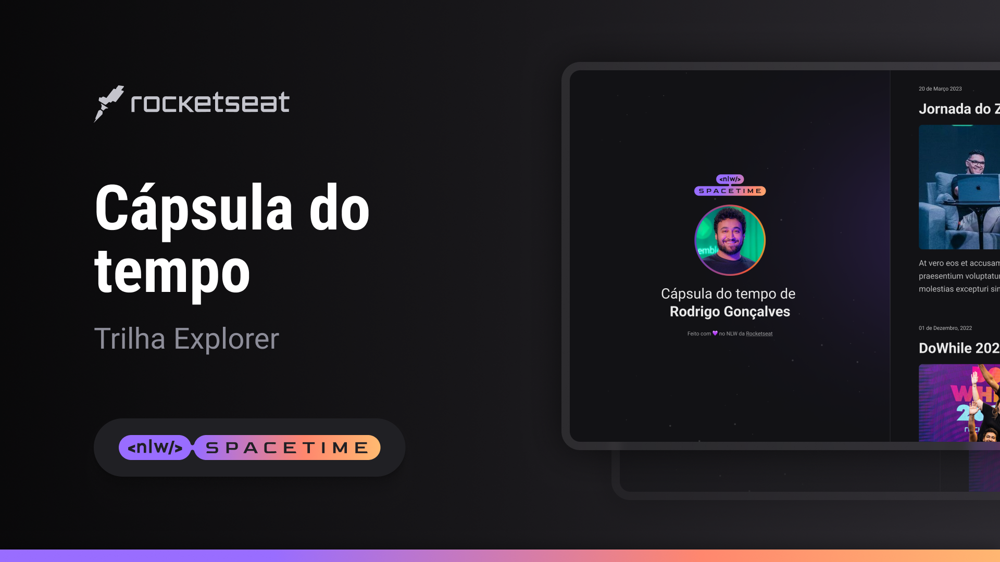

  

## 🖥️ Projeto 
Esse é um projeto Web Responsivo de uma cápsula do tempo para exibir memórias em uma linha do tempo.
Desenvolvido por Camila Francatti durante o evento NLW Spacetime, promovido pela Rocketseat.

## 🚀 Tecnologias
Esse projeto foi desenvolvido com as seguintes tecnologias: 

- HTML 
- CSS
- Git e Github

## 🏷️ Layout
Você pode vizualizar o layout do projeto através [desse link](https://www.figma.com/file/g6sNU5dN9Ic15Xj3522hjy/C%C3%A1psula-do-tempo-%E2%80%A2-Trilha-Explorer-(Community)?type=design&node-id=306%3A84&t=V2pHIRLjJUwYAGdB-1).
É necessário ter uma conta no [Figma](https://www.figma.com)